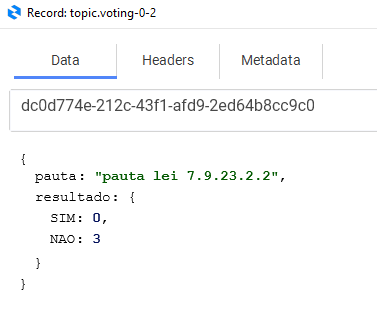

# Kafka Votaçao API

---

* **Objetivo**

O sistema consiste em enviar mensagem do resultado da votação para algum topic do kafka para outros sistemas consumir essa mensagem.

---

* **Preparando o ambiente**

 Para essa etapa, utilizaremos o Kafka + Zookeer e Docker + Docker Compose
  * Dá um git clone nesse repositório https://github.com/confluentinc/cp-docker-images
  * Navegue até na pasta “cp-docker-images/examples/kafka-singlenode”
  * Esta pasta conterá o arquivo “docker-compose.yml”
  * Executar comando docker-compose up –d

Baixar algum visualizador de mensageria de sua preferência<br />Tem o conduKtor https://www.conduktor.io/download/
- a) Cluster name: votacao
- b) Bootstrap Servers: localhost:9092
- c) Topic name: topic.voting




---

### Endpoint 

**Swagger**
http://localhost:7272/swagger-ui/index.html#

**postman** http://localhost:7272/result-voting/send


**Exemplo de payload**
```
[
  {
    "pauta": "pauta 2.0",
    "resultado": {
      "SIM": 3,
      "NAO": 5
    }
  }
]
```